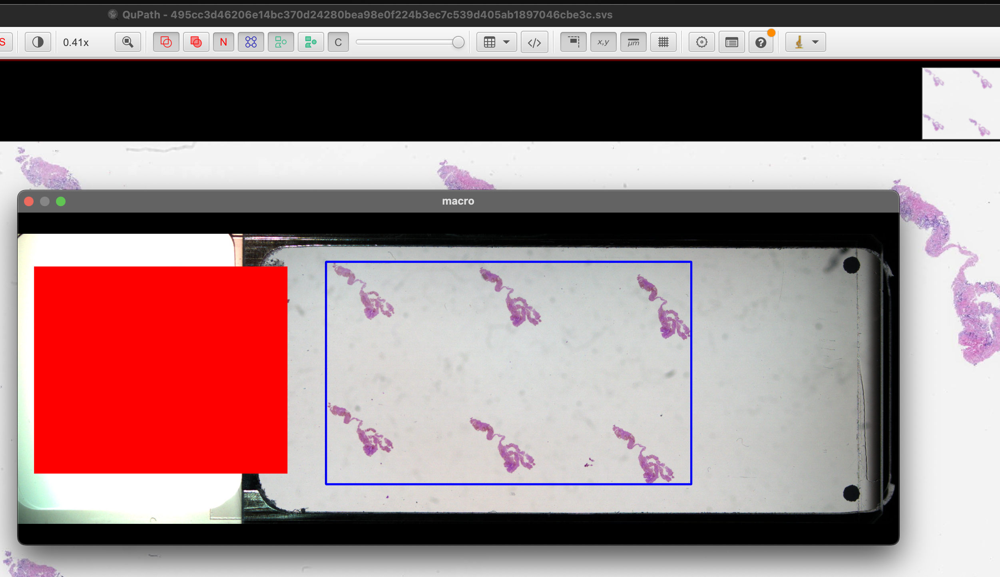

# PHI De-identifier

This tool processes Whole Slide Image (WSI) files (`.svs`, `.tif`, `.tiff`) to remove potentially identifying information. It performs the following steps:

1.  **Copies** input slides to a specified output directory.
2.  **Renames** the copied slides using a unique, salted SHA-256 hash derived from the original filename.
3.  **Removes** the associated "label" image from the copied slide.
4.  **Redacts** the associated "macro" image by drawing a solid red rectangle over areas containing PHI.
5.  **Strips** non-technical metadata fields from the TIFF image description tag.
6.  **Generates** a CSV mapping file (`hash_mapping.csv` by default) to link original filenames to their hashed counterparts and track file paths.

Example macro image with PHI bounding boxes and tissue regions:


Example macro image with red rectangle drawn over PHI:



# Quick Start with Docker

The easiest way to use this tool is with Docker, which bundles both the Python backend and Next.js frontend.

```bash
# Build the Docker image
./start.sh build

# Run with simple directory arguments
./start.sh run --dir=./sample/identified --out=./deidentified

# Or run in detached mode
./start.sh run --dir=./sample/identified --out=./deidentified -d
```

This will start:

- FastAPI server on port 8000 (http://localhost:8000)
- Next.js frontend on port 3000 (http://localhost:3000)

## Docker Options

The `start.sh` script provides simple directory options and more advanced configuration:

```bash
# Show all available options
./start.sh help

# Basic usage with input and output directories
./start.sh run --dir=./sample/identified --out=./deidentified

# Run with custom ports
./start.sh run --fastapi-port=9000 --nextjs-port=4000

# Add Google Cloud credentials for OCR
./start.sh run --dir=./path/to/slides --credentials=/path/to/gcp-credentials.json

# Advanced usage for custom mounting
./start.sh run -v /path/to/slides:/app/sample/identified -v /path/to/output:/app/deidentified
```

## Example Docker Command for Production

```bash
./start.sh build && \
./start.sh run -d \
  --dir=./sample/identified \
  --out=./deidentified \
  --credentials=/path/to/gcp-credentials.json
```

# Installation (Without Docker)

```bash
uv sync

# for macos
brew install zbar libdmtx
export DYLD_FALLBACK_LIBRARY_PATH=$(brew --prefix zbar)/lib/:$(brew --prefix libdmtx)/lib/
```

# Recommended Workflow

## 1. Identify Bounding Boxes (Pre-processing)

First, identify areas containing PHI in the slides using the `identify_boxes.py` script:

```bash
# Identify bounding boxes directly from SVS/TIFF slides and save to JSON (saves to ./identified_boxes.json by default)
# The script supports brace expansion in glob patterns
uv run python identify_boxes.py "./sample/identified/*.{svs,tif,tiff}" --save-boxes-json

# You can also specify multiple patterns separately
uv run python identify_boxes.py "./sample/identified/*.svs" "./sample/identified/*.tif" --save-boxes-json

# You can also identify bounding boxes from extracted macro images
uv run python identify_boxes.py "./sample/macro_images/*.{jpg,png}" --output ./sample/macro_images_annotated/ --save-boxes-json

# To specify a custom JSON output path:
uv run python identify_boxes.py "./sample/macro_images/*.{jpg,png}" --boxes-json-path ./sample/identified_boxes.json

# You can inspect the JSON file to verify the identified boxes are correct
```

## 2. De-identify Slides

Then, use the identified boxes with `deidentify.py` to process the slides:

```bash
# Process slides using pre-identified bounding boxes
uv run deidentify.py "sample/identified/*.{svs,tif,tiff}" \
    --salt "your-secret-salt-here" \
    -o sample/deidentified \
    --boxes-json identified_boxes.json
```

# Alternative Usage

You can also use `deidentify.py` directly without the pre-identification step:

```bash
# Default centered rectangle
uv run deidentify.py "sample/identified/*.{svs,tif,tiff}" \
    --salt "your-secret-salt-here" \
    -o sample/deidentified \
    -m sample/hash_mapping.csv \
    --macro-description "macro"

# Specify custom rectangle coordinates (x0 y0 x1 y1)
uv run deidentify.py "path/to/slides/*.svs" \
    --salt "your-secret-salt-here" \
    -o output_dir \
    --rect 100 150 500 600
```

# Web Client (Without Docker)

```bash
export SLIDE_PATTERN="sample/identified/*.{svs,tif,tiff}"
export PERSIST_JSON_PATH="boxes.json"
export DEIDENTIFIED_DIR="deidentified"
uv run uvicorn server:app --reload --host 0.0.0.0 --port 8000

# In a separate terminal, start the Next.js frontend
cd nextjs
bun run dev
```

# Options for identify_boxes.py

- `input_paths`: One or more input file paths or glob patterns (e.g., `"*.jpg"`, `"*.svs"`, `"path/to/slide.tif"`).
- `--output`: Optional path for output annotated images. If processing multiple images, specifies the output directory.
- `--hide-window`: Do not display the image window, even if no output path is specified.
- `--project`: Google Cloud project ID for Vertex AI (Gemini).
- `--location`: Google Cloud location for Vertex AI (Gemini).
- `--save-boxes-json`: Save identified bounding boxes to a JSON file (identified_boxes.json) in the root directory.
- `--boxes-json-path`: Custom path for the output JSON file with identified boxes.
- `--macro-description`: String identifier for the macro image in SVS/TIFF files (default: `macro`). Case-insensitive.

# Options for deidentify.py

- `slides`: One or more input file paths or glob patterns (e.g., `"*.svs"`, `"path/to/slide.tif"`). Supports basic brace expansion like `{svs,tif}`.
- `-o, --out`: Specifies the output directory for de-identified slides (default: `deidentified`).
- `--salt`: A required secret string used for hashing filenames. **Keep this secure!**
- `-m, --map`: Specifies the path for the output CSV mapping file (default: `hash_mapping.csv`).
- `--macro-description`: String used to identify the macro image's description tag (case-insensitive, default: `macro`).
- `--rect`: Four integer coordinates `x0 y0 x1 y1` defining the redaction rectangle in the macro image. Omitting this option will preserve the original macro image **unchanged**.
- `--boxes-json`: Path to a JSON file containing pre-identified bounding boxes for each slide. Generated by `identify_boxes.py`.

**Note:** The script will only modify macro images if either `--rect` or `--boxes-json` is specified. Otherwise, it will leave the macro image unchanged while still de-identifying other aspects of the slide.